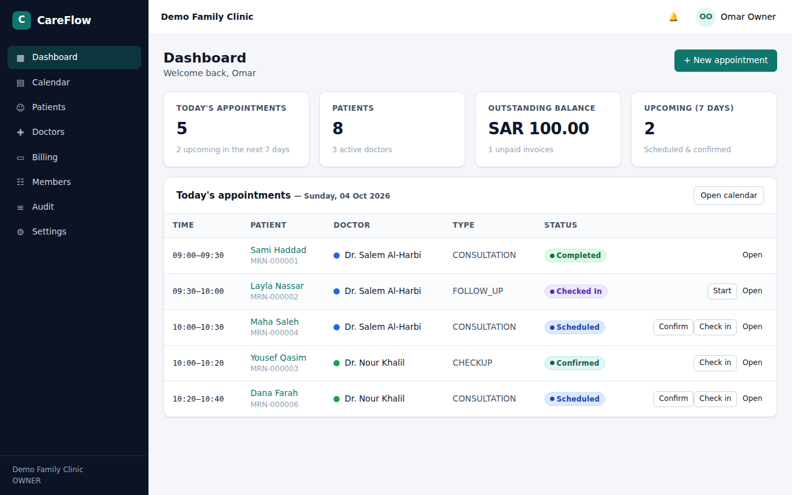
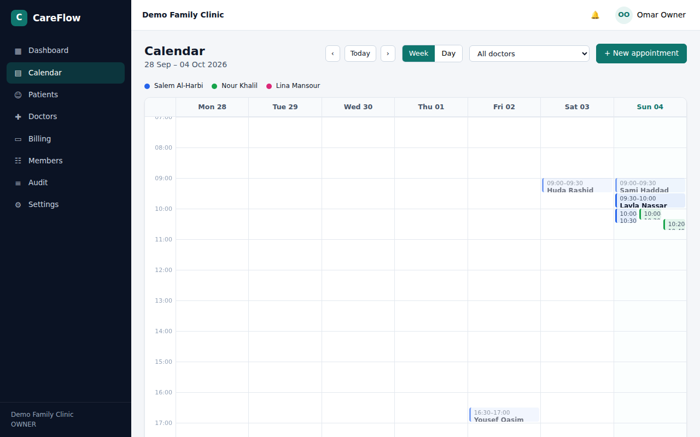
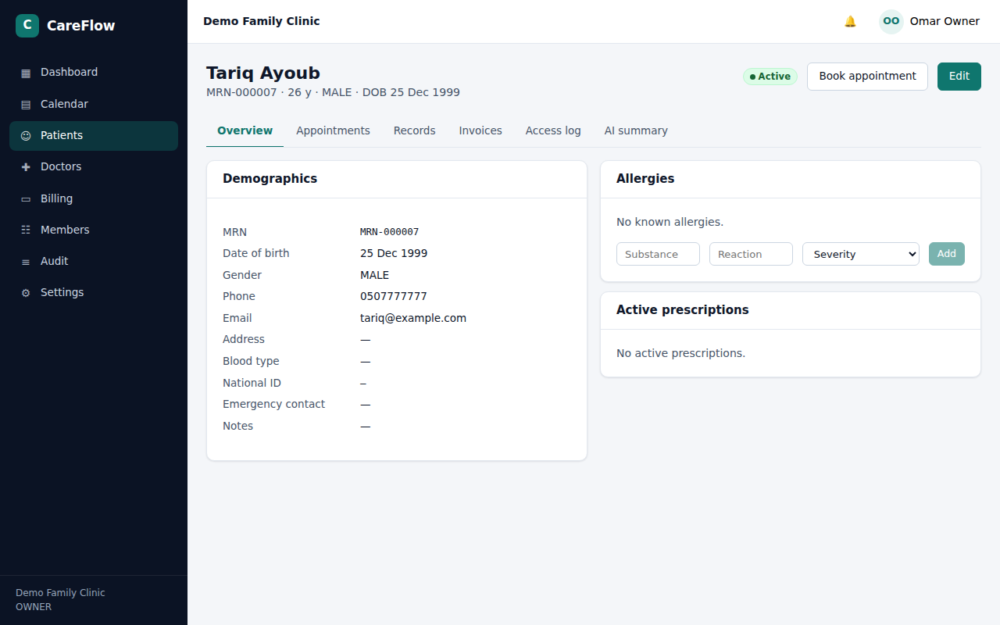
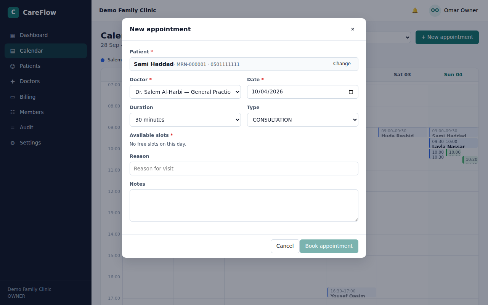
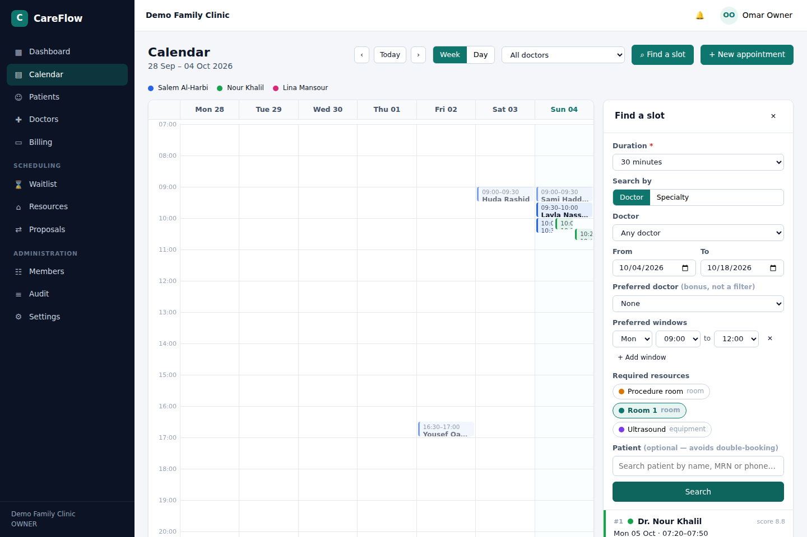
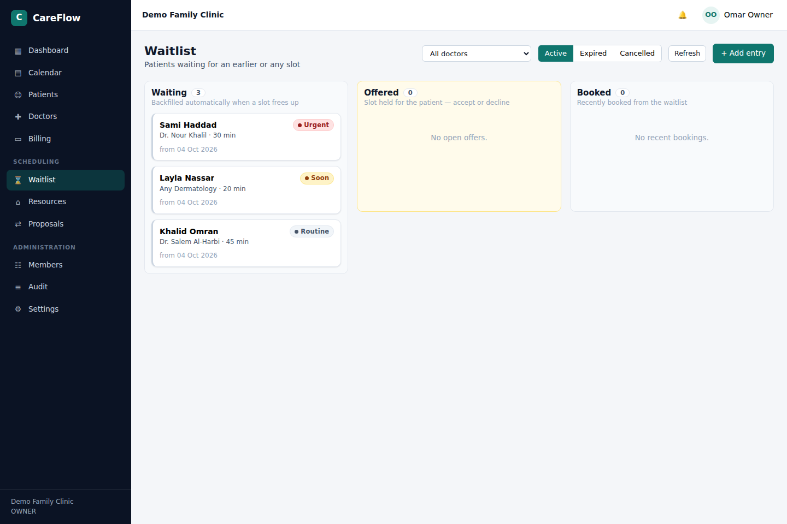
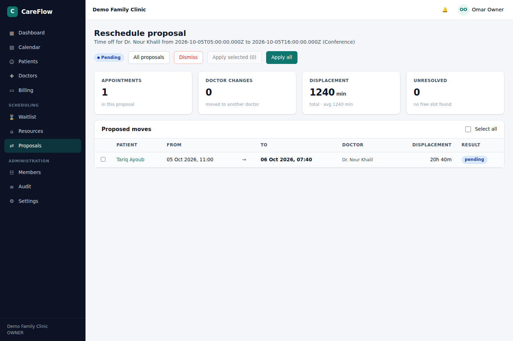
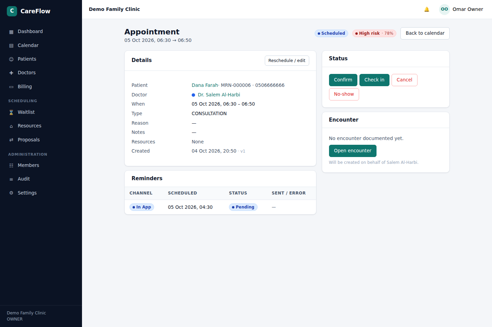

# 🏥 CareFlow

Multi-tenant clinic management platform: doctors, patients, appointments with
conflict-free scheduling, medical records, billing, real-time notifications,
fine-grained permissions, a full audit trail, a scheduling engine (smart slot
search, resources, waitlist backfill, recurring series, min-cost rescheduling,
no-show prediction, reminders), Arabic-aware search, a patient portal with OTP
login and SMS/WhatsApp/email messaging, an Arabic (RTL) and English UI, and an AI
assistant layer (Claude or Gemini) for patient summaries, SOAP note drafting and
"ask the record" with citations.

| Layer | Stack |
|---|---|
| API | NestJS 12 · Prisma 6 · PostgreSQL 16 (Row-Level Security, pg_trgm, pgvector) · Socket.IO · Twilio/SMTP |
| Web | Angular 21 (standalone, signals, ngx-translate, Arabic RTL default) |
| AI | `@anthropic-ai/sdk` (Claude) · `@google/genai` (Gemini) behind one provider interface |

See [docs/ARCHITECTURE.md](docs/ARCHITECTURE.md), [docs/API.md](docs/API.md) and
[docs/SCHEDULING.md](docs/SCHEDULING.md) (the scheduling engine) and
[docs/PHASE3.md](docs/PHASE3.md) (search, Arabic/RTL, patient portal, messaging).

## Quick start

```bash
pnpm install
docker compose up -d db                 # PostgreSQL 16 with pgvector (or your own; run CREATE EXTENSION vector as superuser)
cp apps/api/.env.example apps/api/.env  # edit secrets
pnpm db:migrate                         # applies migrations incl. RLS policies
pnpm db:seed                            # demo clinic + users (password: Password123)
pnpm dev                                # API on :3000 (/docs for Swagger), web on :4200
```

Demo logins: `owner@demo.clinic`, `admin@demo.clinic`, `dr.salem@demo.clinic`,
`dr.nour@demo.clinic`, `reception@demo.clinic`, `finance@demo.clinic`.

## Scripts

| Command | What it does |
|---|---|
| `pnpm --filter api start:dev` | API with watch mode |
| `pnpm --filter api test` / `test:e2e` | unit / end-to-end tests (e2e needs the database) |
| `pnpm --filter api lint` | oxlint |
| `pnpm --filter web start` | Angular dev server |
| `pnpm build` | build both apps |

## Screens

| Dashboard | Calendar |
|---|---|
|  |  |

| Patient profile | Booking dialog |
|---|---|
|  |  |

| Find a slot (ranked search) | Waitlist board |
|---|---|
|  |  |

| Reschedule proposal | No-show risk |
|---|---|
|  |  |

More in [docs/screenshots](docs/screenshots).
